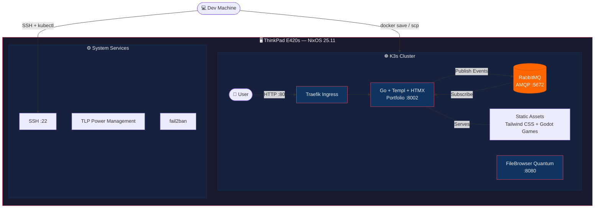

# Portfolio website

A self-hosted portfolio platform built on the **GOTH Stack** (Go, HTMX, Templ, Tailwind CSS), orchestrated with Kubernetes and powered by real-time event streaming via RabbitMQ — all running on bare-metal NixOS.

## Motivation

Most developer portfolios are static sites deployed to Vercel or Netlify. There's nothing wrong with that, but it doesn't demonstrate any infrastructure knowledge. I wanted my portfolio to *be* the project — a production system that showcases backend engineering, container orchestration, and bare-metal server management, not just a page that talks about them.

The result is a portfolio that runs on a repurposed ThinkPad in my apartment, deployed via Kubernetes, with a message broker tracking user interactions in real time. Every layer of the stack is something I built, configured, and maintain myself.

## Architecture


```
┌─────────────────────────────────────────────────┐
│              ThinkPad E420s (NixOS)             │
│                                                 │
│  ┌──────────────┐  ┌─────────────────────────┐  │
│  │    K3s       │  │   System Services       │  │
│  │  ┌─────────┐ │  │  ┌───────────────────┐  │  │
│  │  │Portfolio│ │  │  │  FileBrowser      │  │  │
│  │  │  :8002  │ │  │  │  Quantum          │  │  │
│  │  └───┬─────┘ │  │  └───────────────────┘  │  │
│  │      │       │  └─────────────────────────┘  │
│  │  ┌───▼────┐  │                               │
│  │  │RabbitMQ│  │                               │
│  │  │  :5672 │  │                               │
│  │  └────────┘  │                               │
│  └──────────────┘                               │
└─────────────────────────────────────────────────┘
```


| Component          | Role                                      |
|--------------------|-------------------------------------------|
| **Go + Templ**     | Server-side rendered HTML with type safety |
| **HTMX**          | Dynamic page updates without a JS framework |
| **Tailwind CSS 4** | Utility-first styling                     |
| **RabbitMQ**       | Event streaming for user activity logging |
| **K3s**            | Lightweight Kubernetes on bare metal      |
| **NixOS**          | Declarative, reproducible server config   |
| **FileBrowser Quantum** | Web-based remote file management     |


## Quick Start

### Prerequisites

- [NixOS](https://nixos.org/) with flakes enabled
- [Docker](https://www.docker.com/) for building container images
- [kubectl](https://kubernetes.io/docs/tasks/tools/) configured for your cluster

### Deploy

```bash
# Build the container image
docker build -t portfolio:latest .

# Apply the Kubernetes manifests
kubectl apply -f kubernetes/
```

The site will be available once the pods are running:

```bash
kubectl get pods
kubectl port-forward service/portfolio-service 8000:80
```

Open **http://localhost:8000** in your browser.

### Local Development

If you want to run the stack locally outside of Kubernetes:

```bash
# Enter the Nix development shell
nix develop

# Generate Templ files, compile Tailwind, and run the server
templ generate
tailwindcss -i ./internal/assets/css/input.css -o ./internal/views/css/output.css
go run cmd/web/main.go
```

The dev server starts on **http://localhost:8002**. RabbitMQ is optional — the app gracefully falls back to offline mode if it can't connect.

## Usage

### Kubernetes Manifests

The `kubernetes/` directory contains everything needed to run the full stack:

| Manifest                              | Description                          |
|---------------------------------------|--------------------------------------|
| `portfolio-deployment.yaml`           | Main Go application pod              |
| `portfolio-service.yaml`              | ClusterIP service exposing port 80   |
| `portfolio-configmap.yaml`            | Application configuration            |
| `portfolio-rabbitmq-deployment.yaml`  | RabbitMQ message broker pod          |
| `portfolio-rabbitmq-service.yaml`     | RabbitMQ service (AMQP + Management) |
| `portfolio-rabbitmq-pvc.yaml`         | Persistent storage for RabbitMQ      |
| `portfolio-rabbitmq-configmap.yaml`   | RabbitMQ configuration               |

### Event Streaming

User interactions are published to RabbitMQ via topic exchange. The system uses a subscriber pattern to log events in real time:

```
Exchange: portfolio_topic (topic)
Queue:    game_logs (durable)
```

Events are serialized with Go's `encoding/gob` and routed by key pattern.

### Development Aliases

The Nix dev shell provides shortcuts:

| Alias      | Command                                                                   |
|------------|---------------------------------------------------------------------------|
| `tgr`      | Generate Templ → Compile Tailwind → Run server                           |
| `tailcomp` | Compile Tailwind CSS only                                                 |
| `k`        | `kubectl`                                                                 |
| `kgp`      | `kubectl get pods`                                                        |

## Server Configuration

The ThinkPad runs **NixOS 25.11 Minimal** with a fully declarative `configuration.nix`. Key infrastructure decisions:

- **K3s** instead of Minikube — native Kubernetes without the VM overhead
- **Lid close ignored** — the laptop runs as a headless server
- **Wi-Fi power saving disabled** — prevents SSH dropouts
- **fail2ban** enabled — brute-force SSH protection
- **Neovim** as the default editor with system-level LSPs and formatters (Mason doesn't work on NixOS)
- **Norwegian keyboard layout** configured at the console level
